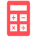
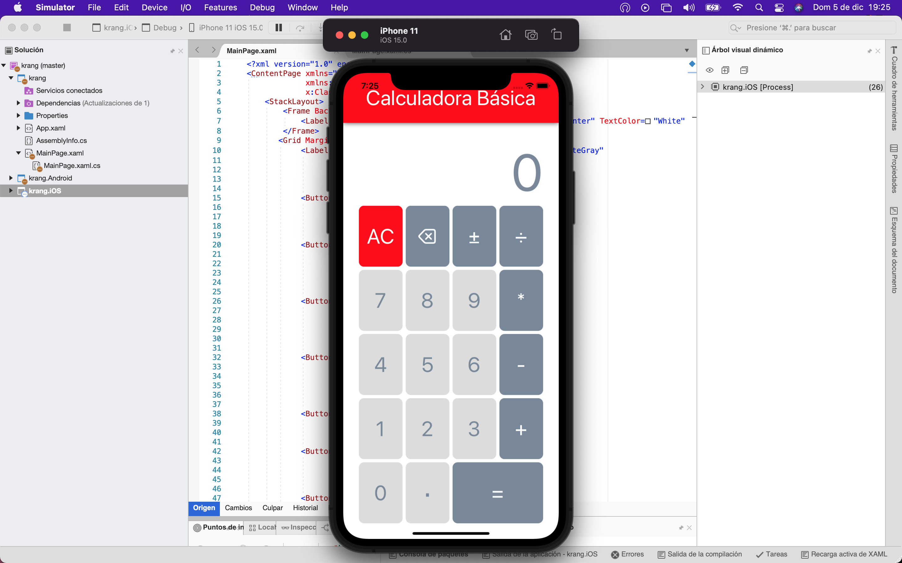
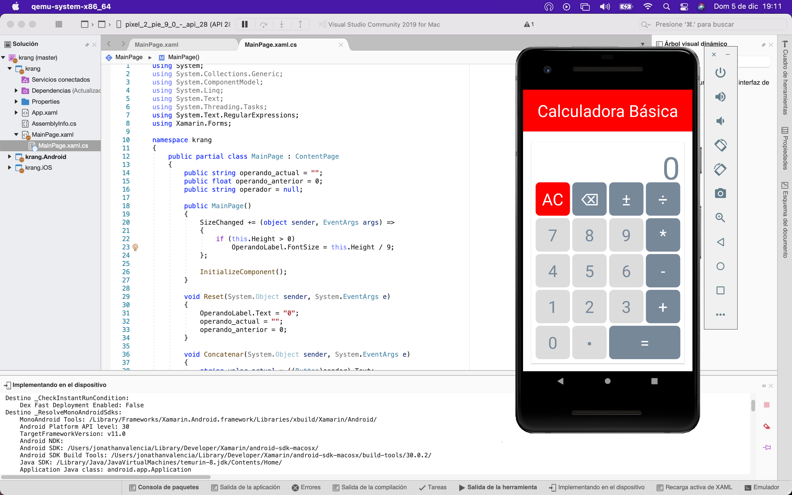

#  Calculadora básica en C#

[](https://play.google.com/store/apps/details?id=com.eaglesolutions.krang&utm_source=github)

Código de ejemplo de una calculadora básica, espero le pueda servir a alguien como introducción al desarrollo de aplicaciones nativas para __iOS__ y __android__ con **Xamarin Forms**.

Disponible para ser desacargada desde Play Store, si tienes correcciones o mejoras no dudes en enviarme PR o escribirme a j.morales@eaglesolutions.com.mx.

<div>
  <p>
  
  </p>
  <p>
  Para cambiar la configuración de ejecución activa, abre el menú contextual sobre la carpeta del proyecto y haz clic en <b>establecer como proyecto de inicio</b>.
  </p> 
  <p>
  
  </p>
</div>

#### Si lanzas tu propia versión no olvides renombrar el paquete en el `AndroidManifest.XML`

```
<?xml version="1.0" encoding="utf-8"?>
<manifest xmlns:android="http://schemas.android.com/apk/res/android" android:versionName="1.2" package="com.eaglesolutions.krang" android:versionCode="3">
	<uses-sdk android:minSdkVersion="21" android:targetSdkVersion="30" />
	<application android:label="krang.Android" android:theme="@style/MainTheme"></application>
	<uses-permission android:name="android.permission.ACCESS_NETWORK_STATE" />
</manifest>
```

